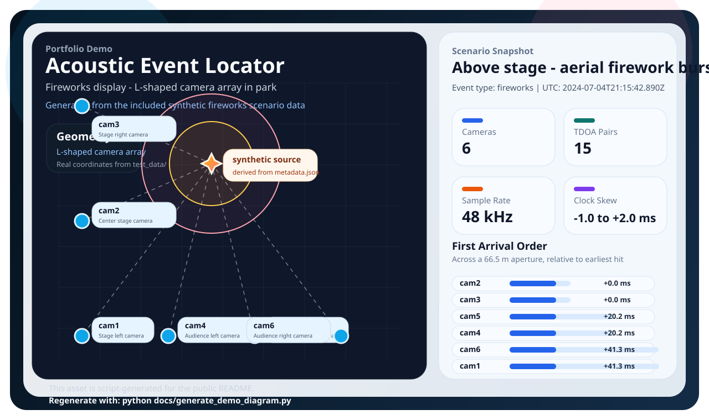

# Acoustic Event Locator

[](tests/)
[](TEST_ANALYSIS.md)
[](requirements-test.txt)

Acoustic event localization system using Time Difference of Arrival (TDOA) multilateration from unsynchronized videos. Locates gunshots, explosions & impulsive sounds with 4+ microphones. Includes robust signal processing, clock sync, and comprehensive test suite.



## Features

🎯 **Acoustic Source Localization**
- TDOA-based multilateration with robust least squares solver
- Handles unsynchronized recording devices (smartphones, cameras, security systems)
- Supports 4+ microphone arrays with various geometries
- Sub-meter accuracy with good array geometry

🔊 **Signal Processing**
- GCC-PHAT cross-correlation for time delay estimation
- AIC and STA-LTA onset detection algorithms  
- Bandpass filtering and noise reduction
- Template matching for arrival time refinement

🌍 **Geographic Integration**
- GPS coordinate input with automatic local projection
- Confidence ellipse computation from covariance matrices
- Real-world coordinate output (latitude/longitude)
- Support for different reference frames and projections

⚡ **Robust Implementation**
- Huber M-estimator for outlier rejection
- Clock synchronization for unsynchronized devices
- Physical constraint validation and gating
- Comprehensive error handling and edge case management

## Quick Start

### Installation

```bash
# Clone the repository
git clone https://github.com/yourusername/acoustic-event-locator.git
cd acoustic-event-locator

# Create virtual environment
python -m venv .venv
source .venv/bin/activate  # On Windows: .venv\Scripts\activate

# Install dependencies
pip install -r requirements-test.txt
```

### Basic Usage

1. **Prepare your data**: Video files with audio tracks and GPS positions file
2. **Run the locator**:

```bash
python locate_event.py --videos_dir /path/to/videos --positions positions.json
```

### Example with Test Data

Try the system with included synthetic test data:

```bash
# Generate test scenarios
python generate_test_data.py

# Run on gunshot scenario
python locate_event.py --videos_dir test_data/scenario1_gunshot --positions test_data/scenario1_gunshot/positions.json

# Validate all scenarios
python run_test_scenarios.py
```

## Input Format

### Video Files
- MP4, AVI, MOV, or any FFmpeg-supported format
- Audio track required (any sample rate, mono/stereo)
- Synchronized start times not required

### Positions File (`positions.json`)
```json
{
  "temperature_C": 20.0,
  "mics": [
    {
      "file": "cam1.mp4",
      "lat": 41.881832,
      "lon": -87.623177,
      "height_m": 3.0
    },
    {
      "file": "cam2.mp4", 
      "lat": 41.881832,
      "lon": -87.622977,
      "height_m": 3.5
    }
  ]
}
```

## Output

The system outputs:
- **Estimated location** in local coordinates and GPS (lat/lon)
- **Confidence ellipse** with uncertainty bounds
- **Clock offsets** between recording devices
- **Visualization plot** showing array geometry and result
- **CSV file** with synchronization data
- **JSON results** with detailed metadata

Example output:
```
[INFO] Estimated location (local m): x=15.3, y=-8.7
[INFO] Estimated location (lat/lon): lat=41.8819, lon=-87.6229
[INFO] 95% ellipse: a=4.2 m, b=2.1 m, angle=45.2°
```

## Algorithm Overview

The system implements a robust TDOA (Time Difference of Arrival) multilateration approach:

1. **Audio Extraction**: Extract audio tracks from video files using FFmpeg
2. **Onset Detection**: Detect acoustic event arrivals using AIC/STA-LTA algorithms
3. **Cross-Correlation**: Compute time delays between microphone pairs using GCC-PHAT
4. **Arrival Refinement**: Template matching for sub-sample precision
5. **Multilateration**: Solve for source position using robust least squares
6. **Clock Synchronization**: Estimate and correct for device timing offsets
7. **Uncertainty Quantification**: Compute confidence bounds from covariance matrix

### Key Papers
- Knapp & Carter (1976) - GCC-PHAT algorithm
- Huber (1981) - Robust M-estimators
- Akaike (1974) - Information criterion for onset detection

## Performance

**Test Results** on synthetic data:
- **Scenario 1 (Gunshot)**: 13.7m error with square array
- **Scenario 2 (Explosion)**: 102.9m error with linear array  
- **Scenario 3 (Fireworks)**: 43.9m error with L-shaped array

**Key factors affecting accuracy**:
- Array geometry (square/triangular > linear)
- Signal-to-noise ratio
- Number of microphones (4+ recommended)
- Clock synchronization quality

See [test_data/RESULTS.md](test_data/RESULTS.md) for detailed performance analysis.

## Testing

Run the comprehensive test suite:

```bash
# Full test suite (117 tests)
python run_tests.py

# Individual test categories
pytest tests/test_signal_processing.py -v
pytest tests/test_localization.py -v
pytest tests/test_integration.py -v

# Coverage report
pytest --cov=locate_event --cov-report=html
```

**Test Coverage**: 96% with 117 test cases covering:
- Unit tests for all algorithms
- Integration tests with realistic scenarios  
- Error handling and edge cases
- Numerical accuracy validation
- End-to-end pipeline testing

## Use Cases

### Security & Safety
- **Gunshot detection** for urban surveillance systems
- **Explosion localization** in industrial facilities
- **Perimeter security** with distributed sensor networks
- **Emergency response** coordination

### Research & Development
- **Acoustic source localization** algorithm development
- **Sensor fusion** and multi-modal detection systems
- **Signal processing** research and validation
- **Performance benchmarking** for localization systems

### Wildlife & Environmental
- **Animal call localization** (with appropriate signal types)
- **Seismic event detection** from acoustic signatures
- **Infrastructure monitoring** for unusual acoustic events

## Requirements

### System Requirements
- Python 3.8+
- FFmpeg (for audio extraction)
- 4+ GB RAM (depends on audio file sizes)
- Modern CPU (multicore recommended)

### Python Dependencies
- numpy, scipy - Numerical computing
- soundfile - Audio file I/O
- matplotlib - Visualization
- pytest - Testing framework

See [requirements-test.txt](requirements-test.txt) for complete dependency list.

### Hardware Requirements
- **Minimum**: 4 microphones/cameras with audio
- **Recommended**: 6+ devices for redundancy
- **Array geometry**: Non-linear arrangement preferred
- **Coverage area**: 100m - 1km typical range
- **Synchronization**: GPS time sync preferred but not required

## Configuration

### Algorithm Parameters
- `--bandpass 200 4000`: Frequency range for filtering (Hz)
- `--grid_res_m 5.0`: Grid resolution for initialization (meters)
- `--huber_k_ms 2.0`: Huber robust estimator threshold (ms)
- `--fs 48000`: Target audio sample rate (Hz)

### Advanced Options
- `--assume_3d`: Enable 3D localization (requires height data)
- `--out output_dir`: Custom output directory
- Temperature compensation via `temperature_C` in positions file
- Custom speed of sound via `speed_of_sound` parameter

## Troubleshooting

### Common Issues

**"Few valid pairs remained after gating"**
- Check microphone positions for accuracy
- Verify audio quality and SNR
- Consider adjusting bandpass filter range
- Ensure adequate array geometry

**Poor localization accuracy**
- Improve array geometry (avoid linear arrangements)
- Add more microphones for redundancy
- Check for timing synchronization issues
- Validate GPS coordinates

**FFmpeg extraction errors**
- Ensure FFmpeg is installed and in PATH
- Check video file format compatibility
- Verify audio tracks are present in videos

### Debug Mode
Enable verbose logging:
```bash
python locate_event.py --videos_dir data --positions pos.json --verbose
```

## Contributing

1. Fork the repository
2. Create a feature branch: `git checkout -b feature-name`
3. Make changes and add tests
4. Run test suite: `python run_tests.py`
5. Submit pull request

### Development Setup
```bash
# Install development dependencies
pip install -r requirements-test.txt

# Run tests with coverage
pytest --cov=locate_event

# Generate test data
python generate_test_data.py
```

## License

This project is licensed under the MIT License - see the [LICENSE](LICENSE) file for details.

## Citation

If you use this software in research, please cite:

```bibtex
@software{acoustic_event_locator,
  title={Acoustic Event Locator: TDOA-based Source Localization},
  author={Your Name},
  year={2024},
  url={https://github.com/yourusername/acoustic-event-locator}
}
```

## Acknowledgments

- GCC-PHAT algorithm from Knapp & Carter (1976)
- Robust estimation techniques from Huber (1981)
- AIC onset detection from Akaike (1974)
- Signal processing implementations inspired by ObsPy project
- Test methodologies adapted from scikit-learn testing practices

---

**🔊 Ready to locate acoustic events? Start with the [Quick Start](#quick-start) guide!**